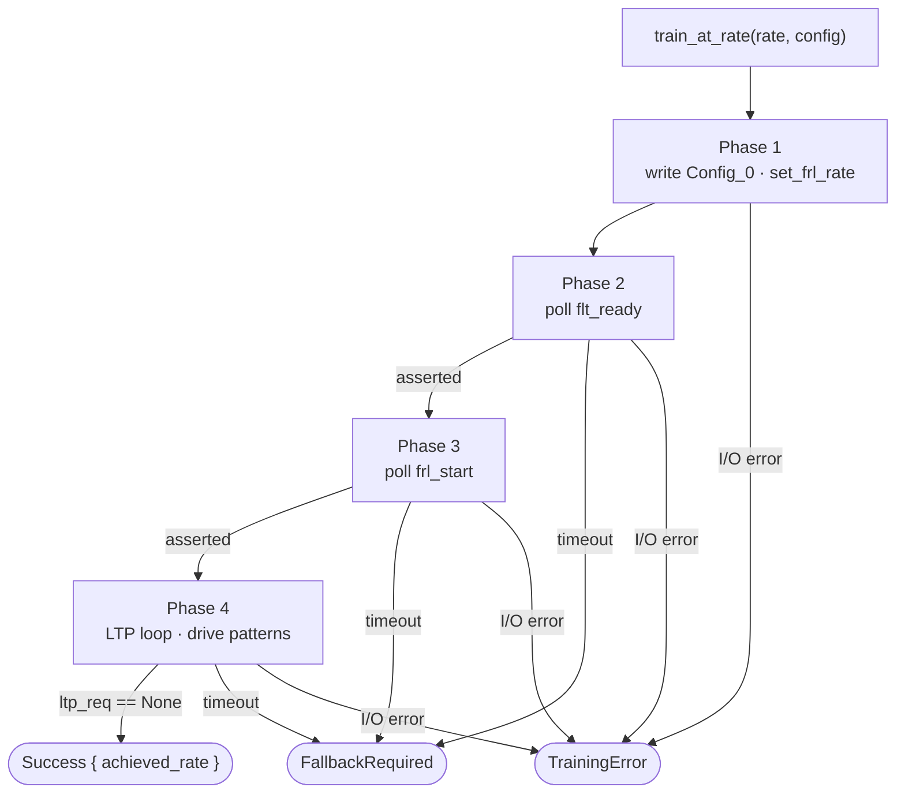
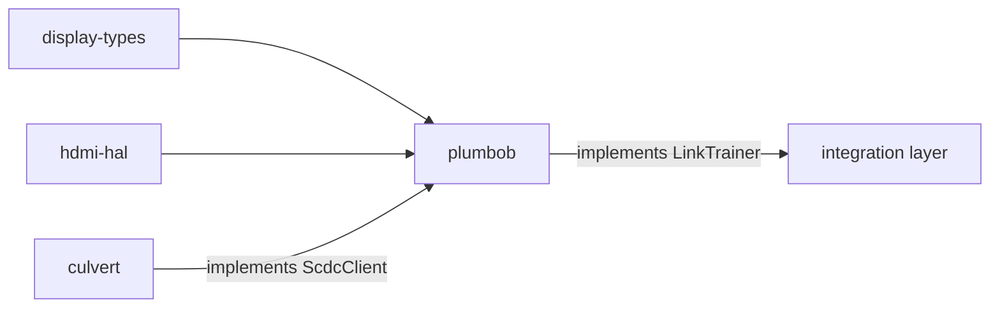

# plumbob

[](https://github.com/DracoWhitefire/plumbob/actions/workflows/ci.yml)
[](https://crates.io/crates/plumbob)
[](https://docs.rs/plumbob)
[](LICENSE)
[](https://blog.rust-lang.org/2025/02/20/Rust-1.85.0.html)
[](https://slsa.dev)

FRL link training state machine for HDMI 2.1.

`plumbob` implements the Fixed Rate Link (FRL) training procedure defined in the HDMI 2.1
specification. It owns the four-phase state machine — configuration, readiness polling,
initiation polling, and the LTP pattern loop — and defines the `ScdcClient` interface its
SCDC implementation must satisfy. Callers supply an `ScdcClient` and an `HdmiPhy`, call
`train_at_rate` for each rate to attempt, and handle the `TrainingOutcome`.

Rate fallback policy, SCDC register decoding, and PHY vendor sequences are all out of
scope: plumbob implements the spec, not the strategy around it.

## Usage

```toml
[dependencies]
plumbob = "0.1"
```

Implement `ScdcClient` against your SCDC transport:

```rust
use plumbob::{ScdcClient, CedCounters, FrlConfig, TrainingStatus};

struct MyScdcClient { /* I²C / DDC transport */ }

impl ScdcClient for MyScdcClient {
    type Error = MyError;

    fn write_frl_config(&mut self, config: FrlConfig) -> Result<(), MyError> {
        // write rate and FFE level count to SCDC Config_0
        todo!()
    }

    fn read_training_status(&mut self) -> Result<TrainingStatus, MyError> {
        // read flt_ready, frl_start, ltp_req from SCDC Status_Flags
        todo!()
    }

    fn read_ced(&mut self) -> Result<CedCounters, MyError> {
        // read per-lane character error counts from SCDC
        todo!()
    }
}
```

Construct an `FrlTrainer` and step down through rates until one succeeds:

```rust
use display_types::cea861::hdmi_forum::HdmiForumFrl;
use plumbob::{FrlTrainer, TrainingConfig, TrainingOutcome};

let mut trainer = FrlTrainer::new(scdc, phy);
let config = TrainingConfig::default();

let rates = [
    HdmiForumFrl::Rate12Gbps4Lanes,
    HdmiForumFrl::Rate10Gbps4Lanes,
    HdmiForumFrl::Rate6Gbps4Lanes,
    HdmiForumFrl::Rate3Gbps4Lanes,
];

for rate in rates {
    match trainer.train_at_rate(rate, &config)? {
        TrainingOutcome::Success { achieved_rate } => {
            println!("Trained at {achieved_rate:?}");
            break;
        }
        TrainingOutcome::FallbackRequired => continue,
    }
}
```

For a complete worked example with simulated SCDC and PHY backends, see
[`examples/simulate`](examples/simulate/).

## Training procedure

`train_at_rate` runs all four phases for a single rate attempt and returns a typed terminal
result. `FallbackRequired` means the link did not converge at this rate; `TrainingError`
means a hard I/O failure from the SCDC client or PHY. The two are kept distinct so a caller
diagnosing a failure knows whether it came from the protocol or the bus.



**Phase 1** writes the target rate and FFE level count to Config_0 and configures the PHY
lanes for this rate.

**Phase 2** polls until the sink asserts `flt_ready`, signalling it has completed internal
preparation at the requested rate. Times out after `TrainingConfig::flt_ready_timeout`
iterations.

**Phase 3** polls until the sink asserts `frl_start`, signalling it is ready for the LTP
loop to begin. Times out after `TrainingConfig::frl_start_timeout` iterations.

**Phase 4** drives the sink-requested LTP pattern on the PHY lanes on each iteration until
`ltp_req` reaches `None` (all lanes satisfied), or until `TrainingConfig::ltp_timeout`
iterations have elapsed.

Each timeout value is an exact iteration count: a value of N means at most N poll attempts
are made before the phase gives up. The inter-poll delay is the implementer's
responsibility and belongs inside the `ScdcClient` methods.

## Diagnostics

Enable the `alloc` feature to get `train_at_rate_traced`, which returns a `TrainingTrace`
alongside the outcome. The trace records the rate, the `TrainingConfig` in force, and an
ordered `TrainingEvent` log covering the full attempt:

```rust
let (outcome, trace) = trainer.train_at_rate_traced(rate, &config)?;

println!("Outcome: {outcome:?}");
for event in &trace.events {
    println!("  {event:?}");
}
```

A complete successful trace looks like:

```
RateConfigured { rate: Rate9Gbps3Lanes, ffe_levels: Ffe0 }
FltReadyReceived { after_iterations: 5 }
FrlStartReceived { after_iterations: 12 }
LtpPatternRequested { pattern: Lfsr0 }
LtpPatternRequested { pattern: Lfsr2 }
AllLanesSatisfied { after_iterations: 47 }
```

A trace that timed out in phase 4 — the sink requested patterns but lanes failed to lock:

```
RateConfigured { rate: Rate12Gbps4Lanes, ffe_levels: Ffe0 }
FltReadyReceived { after_iterations: 4 }
FrlStartReceived { after_iterations: 3 }
LtpPatternRequested { pattern: Lfsr1 }
LtpPatternRequested { pattern: Lfsr3 }
LtpLoopTimeout { iterations_elapsed: 1000 }
```

`LtpPatternRequested` is emitted only on transitions, so a sink that holds the same pattern
for many iterations produces one event, not one per poll. Each timeout event names the phase
it came from — a phase 2 timeout means the sink did not complete internal preparation at
this rate; a phase 4 timeout points toward signal integrity or equalization.

## Features

| Feature | Default | Description |
|---------|---------|-------------|
| `std`   | no      | Implies `alloc`; no additional API surface |
| `alloc` | no      | Enables `TrainingTrace`, `TrainingEvent`, and `train_at_rate_traced` |

No features are enabled by default. The bare crate provides the full four-phase state
machine without an allocator.

## `no_std` builds

`plumbob` declares `#![no_std]` throughout.

**Bare `no_std` (no features)** — the complete training state machine is available.
`FrlTrainer`, `TrainingConfig`, `TrainingOutcome`, `TrainingError`, and all owned protocol
types (`LtpReq`, `FfeLevels`, `TrainingStatus`, `CedCounters`) are stack-allocated. No heap
use anywhere in the training loop. This tier covers bare-metal and firmware targets.

**`no_std` + `alloc`** — adds `TrainingTrace` and `train_at_rate_traced`:

```toml
plumbob = { version = "0.1", features = ["alloc"] }
```

**`std`** — implies `alloc`:

```toml
plumbob = { version = "0.1", features = ["std"] }
```

## Stack position

`plumbob` sits between the SCDC/PHY implementations and the integration layer that
orchestrates rate selection and fallback. It defines one interface (`ScdcClient`) and
implements one (`LinkTrainer`) from the layer above.



`plumbob` does not depend on `culvert`. The relationship runs the other way: `culvert`
implements `plumbob::ScdcClient` for `Scdc<T>`, gated behind a `plumbob` cargo feature.
Any crate that implements `ScdcClient` is substitutable.

## Out of scope

- **Rate fallback policy** — `train_at_rate` returns `FallbackRequired`; the caller decides
  the retry sequence and the fallback-to-TMDS threshold.
- **SCDC register decoding** — plumbob reads typed values from `ScdcClient` and does not
  decode raw register bytes or know SCDC register addresses.
- **PHY vendor sequences** — plumbob calls `HdmiPhy::set_frl_rate` and `send_ltp`; the
  register sequences for lane reconfiguration live in platform PHY backends.
- **Timing** — plumbob is synchronous and poll-based. Inter-poll delay is implicit in the
  transport; the iteration limits in `TrainingConfig` are the only timeout mechanism.
- **TMDS link setup** — plumbob handles FRL training only.

## Documentation

- [`doc/architecture.md`](doc/architecture.md) — role, scope, interface boundaries, design
  principles, and the async roadmap

## Verifying releases

Each release is built on GitHub Actions and attested with
[SLSA Build Level 2](https://slsa.dev) provenance. To verify a release
`.crate` against its signed provenance, install the
[GitHub CLI](https://cli.github.com/) and run:

```sh
gh attestation verify plumbob-X.Y.Z.crate --repo DracoWhitefire/plumbob
```

The attested `.crate` is attached to each
[GitHub release](https://github.com/DracoWhitefire/plumbob/releases).

## License

Licensed under the [Mozilla Public License 2.0](LICENSE).
