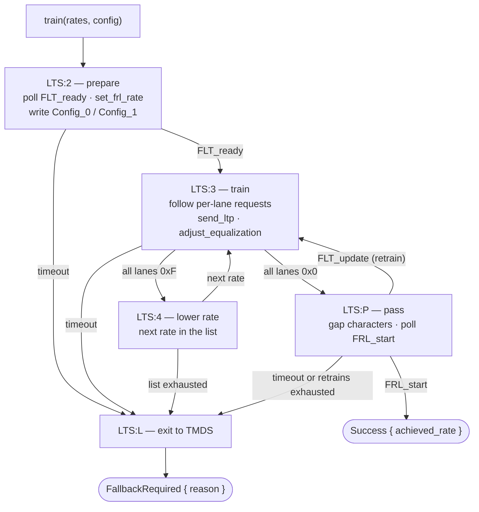
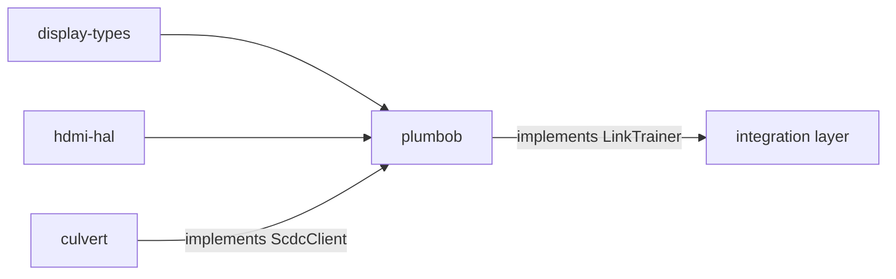

# plumbob

[](https://github.com/DracoWhitefire/plumbob/actions/workflows/ci.yml)
[](https://crates.io/crates/plumbob)
[](https://docs.rs/plumbob)
[](LICENSE)
[](https://blog.rust-lang.org/2025/02/20/Rust-1.85.0.html)
[](https://slsa.dev)

FRL link training state machine for HDMI 2.1.

`plumbob` implements the source side of Fixed Rate Link (FRL) training as defined in the
HDMI 2.1 specification. It owns the link training state machine — LTS:2 (prepare),
LTS:3 (train), LTS:P (pass), LTS:4 (lower rate) and LTS:L (exit to TMDS) — and defines
the `ScdcClient` interface its SCDC implementation must satisfy. Callers supply an
`ScdcClient` and an `HdmiPhy`, call `train` with the rates to try, and handle the
`TrainingOutcome`.

Which rates to try, SCDC register decoding, and PHY vendor sequences are all out of
scope: plumbob implements the spec, not the strategy around it.

## Usage

```toml
[dependencies]
plumbob = "0.1"
```

Implement `ScdcClient` against your SCDC transport, one method per register operation:

```rust
use plumbob::{
    CedCounters, FrlConfig, LtpRequests, ScdcClient, SourceTestConfig, UpdateFlags,
};

struct MyScdcClient { /* I²C / DDC transport */ }

impl ScdcClient for MyScdcClient {
    type Error = MyError;

    // Status_Flags_0 bit 6. Polled in LTS:2: wait the poll interval here.
    fn read_flt_ready(&mut self) -> Result<bool, MyError> { todo!() }
    // Update_0 Source_Test_Update, FRL_start, FLT_update. Polled in LTS:3 and LTS:P.
    fn read_update_flags(&mut self) -> Result<UpdateFlags, MyError> { todo!() }
    // Write 1 to clear the given Update_0 flags.
    fn clear_update_flags(&mut self, flags: UpdateFlags) -> Result<(), MyError> { todo!() }
    // Status_Flags_1/2: the per-lane requests (0x9–0xD are a protocol error).
    fn read_ltp_requests(&mut self) -> Result<LtpRequests, MyError> { todo!() }
    // Source_Test_Configuration: FLT_no_timeout.
    fn read_source_test_config(&mut self) -> Result<SourceTestConfig, MyError> { todo!() }
    // Config_0: read requests disabled, FLT_no_retrain clear.
    fn write_config_0_defaults(&mut self) -> Result<(), MyError> { todo!() }
    // Config_1: FRL rate and FFE levels.
    fn write_frl_config(&mut self, config: FrlConfig) -> Result<(), MyError> { todo!() }
    // ERR_DET counters, for diagnostics.
    fn read_ced(&mut self) -> Result<CedCounters, MyError> { todo!() }
}
```

Construct an `FrlTrainer` and train over the rates to try, highest first. plumbob steps
down through the list when the sink asks for a lower rate:

```rust
use display_types::cea861::hdmi_forum::HdmiForumFrl;
use plumbob::{FrlTrainer, TrainingConfig, TrainingOutcome};

let mut trainer = FrlTrainer::new(scdc, phy);
let config = TrainingConfig::default();

let rates = [
    HdmiForumFrl::Rate12Gbps4Lanes,
    HdmiForumFrl::Rate10Gbps4Lanes,
    HdmiForumFrl::Rate6Gbps4Lanes,
];

match trainer.train(&rates, &config)? {
    TrainingOutcome::Success { achieved_rate } => {
        println!("Trained at {achieved_rate:?}");
        // Start video: phy.set_frl_output(FrlOutput::Active)
    }
    TrainingOutcome::FallbackRequired { reason } => {
        println!("No FRL link ({reason:?}); the sink is back in TMDS");
    }
    _ => {}
}
```

For a complete worked example with simulated SCDC and PHY backends, see
[`examples/simulate`](examples/simulate/).

## Training procedure

`train` runs until a terminal state and returns a typed result. `FallbackRequired` means
no listed rate trained, with a `FallbackReason`; it always leaves the sink and PHY in
TMDS. `TrainingError` means a hard I/O failure from the SCDC client or PHY. The two are
kept distinct so a caller diagnosing a failure knows whether it came from the protocol or
the bus. After an I/O error plumbob still returns both ends to TMDS, and the error's
`exit` field (`TmdsExit`) says whether that worked; set
`TrainingConfig::exit_to_tmds_on_error` to `false` to leave them as the error left them.


```mermaid
flowchart TD
    A["train(rates, config)"]
    P2["LTS:2 — prepare\npoll FLT_ready · set_frl_rate\nwrite Config_0 / Config_1"]
    P3["LTS:3 — train\nfollow per-lane requests\nsend_ltp · adjust_equalization"]
    PP["LTS:P — pass\ngap characters · poll FRL_start"]
    P4["LTS:4 — lower rate\nnext rate in the list"]
    PL["LTS:L — exit to TMDS"]
    S(["Success { achieved_rate }"])
    F(["FallbackRequired { reason }"])

    A --> P2
    P2 -- FLT_ready --> P3
    P2 -- timeout --> PL
    P3 -- "all lanes 0x0" --> PP
    P3 -- "all lanes 0xF" --> P4
    P3 -- timeout --> PL
    P4 -- next rate --> P3
    P4 -- "list exhausted" --> PL
    PP -- FRL_start --> S
    PP -- "FLT_update (retrain)" --> P3
    PP -- "timeout or retrains exhausted" --> PL
    PL --> F
```

**LTS:2** waits for the sink to assert `FLT_ready`, resets every lane's TxFFE level,
configures the PHY for the rate, briefly drives the Nyquist clock pattern, then switches
to gap characters and writes `Config_0` and `Config_1`.

**LTS:3** follows the sink's per-lane requests: each lane carries the pattern it asks
for, 0xE raises that lane's TxFFE level (up to the advertised maximum, then held), and
the full per-lane set is sent to the PHY after every `FLT_update`. All lanes reporting
0x0 passes training; all lanes reporting 0xF asks for a lower rate.

**LTS:P** sends gap characters until the sink sets `FRL_start` (success) or `FLT_update`
(retrain, up to `TrainingConfig::max_retrains` times per call). After `Success`, the caller
starts video with `set_frl_output(Active)`. After `Success` the sink can still request retraining during active video by setting
`FLT_update`; plumbob does not watch for it. The caller polls `Update_0` (the Xilinx
driver checks every 250 ms) and calls `train` again when it is set.

**LTS:4** moves to the next rate in the list and continues LTS:3 there. **LTS:L**
returns both ends to TMDS before any `FallbackRequired`.

Poll limits are exact counts: N means exactly N polls before the state gives up. The
defaults (50 / 100 / 100 polls) reproduce the spec's 100 ms and 200 ms timeouts, and the
200 ms `FRL_start` wait of the AMD and Intel drivers, at one poll every 2 ms. The
inter-poll delay is the implementer's responsibility and belongs inside the polled
`ScdcClient` methods. When the sink sets `FLT_no_timeout`, the LTS:2 and LTS:3 limits are
suspended, up to `TrainingConfig::no_timeout_poll_cap` (default 500 polls, the AMD
driver's cap). Retraining from LTS:P is bounded by `TrainingConfig::max_retrains`
(default 3); the next request after that ends the attempt with `RetrainsExhausted`.

See [`doc/architecture.md`](doc/architecture.md) for the procedure step by step.

## Diagnostics

Enable the `alloc` feature to get `train_traced` (and `train_at_rate_traced`), which
return a `TrainingTrace` alongside the outcome. The trace records the rates, the
`TrainingConfig` in force, and an ordered `TrainingEvent` log covering the full attempt:

```rust
let (outcome, trace) = trainer.train_traced(&rates, &config)?;

println!("Outcome: {outcome:?}");
for event in &trace.events {
    println!("  {event:?}");
}
```

A successful attempt, where the sink asks for one TxFFE raise on lane 1:

```
FltReady { after_polls: 3 }
RateConfigured { rate: Rate12Gbps4Lanes, ffe_levels: FfeLevels(3) }
LtpRequested { requests: LtpRequests { lane0: Lfsr0, lane1: Lfsr1, lane2: Lfsr2, lane3: Lfsr3 } }
LtpRequested { requests: LtpRequests { lane0: None, lane1: FfeChange, lane2: None, lane3: None } }
FfeRaised { lane: 1, level: 1 }
TrainingPassed { after_polls: 41 }
FrlStart { after_polls: 6 }
```

A sink that asks for a lower rate, trained over `[Rate12Gbps4Lanes, Rate10Gbps4Lanes]`:

```
FltReady { after_polls: 2 }
RateConfigured { rate: Rate12Gbps4Lanes, ffe_levels: FfeLevels(3) }
LtpRequested { requests: LtpRequests { lane0: RateChange, lane1: RateChange, lane2: RateChange, lane3: RateChange } }
RateLowered { from: Rate12Gbps4Lanes, to: Rate10Gbps4Lanes }
RateConfigured { rate: Rate10Gbps4Lanes, ffe_levels: FfeLevels(3) }
LtpRequested { requests: LtpRequests { lane0: Lfsr0, lane1: Lfsr0, lane2: Lfsr0, lane3: Lfsr0 } }
TrainingPassed { after_polls: 12 }
FrlStart { after_polls: 4 }
```

Poll counts include the poll that saw the event, so they read directly against the
limits in `trace.config`. A timeout in LTS:2 means the sink did not prepare at this rate;
one in LTS:3 means lanes did not converge (signal integrity or equalization); one in
LTS:P means training passed but the sink never released the link. Every
`FallbackRequired` trace ends with `ExitedToTmds`; if LTS:L fails, the trace ends with
`ExitToTmdsFailed` and `train` returns `TrainingError::ExitFailed`.

## Async and custom drivers

The state machine is written once, as `plumbob::lts::run`: an `async fn` over the
`TrainingIo` trait (the SCDC and PHY operations training performs), which does no I/O of
its own. `FrlTrainer` drives it synchronously over an `ScdcClient` and an `HdmiPhy`, with
no async runtime: its I/O completes immediately, so the function never waits.
[`plumbob-async`](https://crates.io/crates/plumbob-async) drives the same function over
async I/O, so sync and async training cannot drift apart. Implementing `TrainingIo`
yourself drives it from any other environment.

## Features

| Feature | Default | Description |
|---------|---------|-------------|
| `std`   | no      | Implies `alloc`; no additional API surface |
| `alloc` | no      | Enables `TrainingTrace`, `train_traced` and `train_at_rate_traced` |

No features are enabled by default. The bare crate provides the full training state
machine without an allocator.

## `no_std` builds

`plumbob` declares `#![no_std]` throughout.

**Bare `no_std` (no features)** — the complete training state machine is available.
`FrlTrainer`, `TrainingConfig`, `TrainingOutcome`, `TrainingError`, and all owned protocol
types (`LtpReq`, `LtpRequests`, `FfeLevels`, `UpdateFlags`, `CedCounters`, …) are
stack-allocated. No heap use anywhere in the training loop. This tier covers bare-metal
and firmware targets.

**`no_std` + `alloc`** — adds `TrainingTrace`, `train_traced` and `train_at_rate_traced`:

```toml
plumbob = { version = "0.1", features = ["alloc"] }
```

**`std`** — implies `alloc`:

```toml
plumbob = { version = "0.1", features = ["std"] }
```

## Stack position

`plumbob` sits between the SCDC/PHY implementations and the integration layer that
orchestrates rate selection and fallback. It defines one interface (`ScdcClient`) and
implements one (`LinkTrainer`) from the layer above.


```mermaid
flowchart LR
    dt["display-types"]
    hal["hdmi-hal"]
    culvert["culvert"]
    plumbob["plumbob"]
    integration["integration layer"]

    dt --> plumbob
    hal --> plumbob
    culvert -->|"implements ScdcClient"| plumbob
    plumbob -->|"implements LinkTrainer"| integration
```

`plumbob` does not depend on `culvert`. The relationship runs the other way: `culvert`
implements `plumbob::ScdcClient` for `Scdc<T>`, gated behind a `plumbob` cargo feature.
Any crate that implements `ScdcClient` is substitutable.

## Out of scope

- **Rate fallback policy** — the caller decides which rates to pass to `train` and what
  to do with a `FallbackRequired`; plumbob only steps down when the sink asks it to.
- **SCDC register decoding** — plumbob reads typed values from `ScdcClient` and does not
  decode raw register bytes or know SCDC register addresses.
- **PHY vendor sequences** — plumbob calls `HdmiPhy` methods (`set_frl_rate`, `send_ltp`,
  `set_frl_output`, `adjust_equalization`); the register sequences behind them live in
  platform PHY backends.
- **Timing** — plumbob is synchronous and poll-based. The inter-poll delay is the
  `ScdcClient` implementation's; the poll limits in `TrainingConfig` are the only timeout
  mechanism.
- **TMDS link setup** — plumbob handles FRL training only.

## Documentation

- [`doc/architecture.md`](doc/architecture.md) — role, scope, the training procedure,
  interface boundaries, design principles, and the async roadmap
- [`doc/model.md`](doc/model.md) — the protocol, configuration and outcome types
- [`doc/testing.md`](doc/testing.md) — how the state machine is tested without hardware

## Verifying releases

Each release is built on GitHub Actions and attested with
[SLSA Build Level 2](https://slsa.dev) provenance. To verify a release
`.crate` against its signed provenance, install the
[GitHub CLI](https://cli.github.com/) and run:

```sh
gh attestation verify plumbob-X.Y.Z.crate --repo DracoWhitefire/plumbob
```

The attested `.crate` is attached to each
[GitHub release](https://github.com/DracoWhitefire/plumbob/releases).

## License

Licensed under the [Mozilla Public License 2.0](LICENSE).
